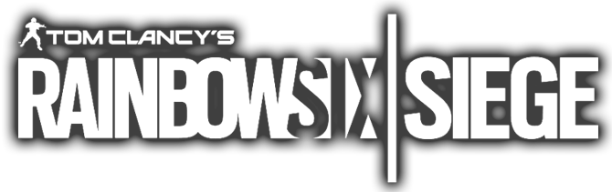

<!DOCTYPE html>
<html lang="pt-br">
<head>
	<meta charset="utf-8">
	<link rel="stylesheet" href="estilo.css">
	
	
	<title>Rainbow Six Siege 2020</title>
	
</head>
<body>

	<nav>

	<ul id="ul-principal">

	<!-- 
 -->

	<<a href="https://www.ubisoft.com/pt-br/"><input type="image" src="img/ubi.png" alt="Submit" width="60" height="49"></a>		
		
	<li class="li-p"></li>
	

	<li class="li-p"><a href="javascript://" class=".bt1">NOTÍCIAS</a>
	<li class="li-p"><a href="#">INFORMAÇÕES DO JOGO</a>
	
<ul class="li-p-links">
	<li><a href="https://www.ubisoft.com/pt-br/game/rainbow-six/siege/game-info">VISÃO GERAL</a></li>
	<li><a href="https://www.ubisoft.com/pt-br/game/rainbow-six/siege/game-info/operators">AGENTES</a></li>
	<li><a href="https://www.ubisoft.com/pt-br/game/rainbow-six/siege/game-info/maps">MAPAS</a></li>

</ul></li>

	<li class="li-p"><a href="#">TEMPORADAS</a>
	<li class="li-p"><a href="#">PASSE DE TEMPORADA</a></li>
	<li class="li-p"><a href="#">JOGADOR R6</a>

<ul class="li-p-links">
	<li><a href="https://game-rainbow6.ubi.com/pt-br/home">MEU PERFIL</a></li>
</ul></li>

</ul>

</nav>

</body>

</html>
